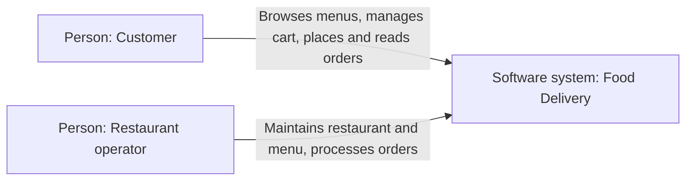
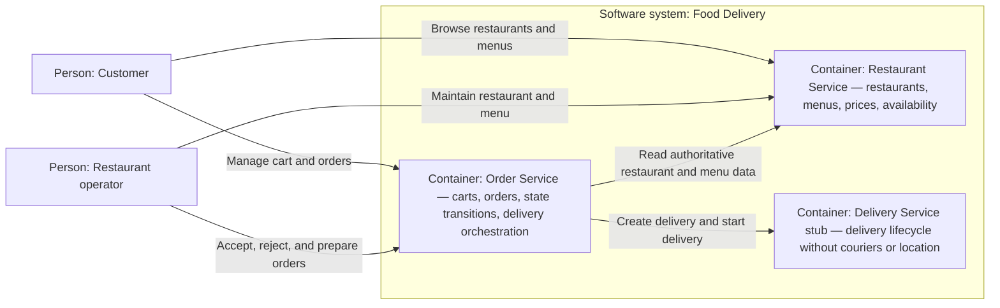
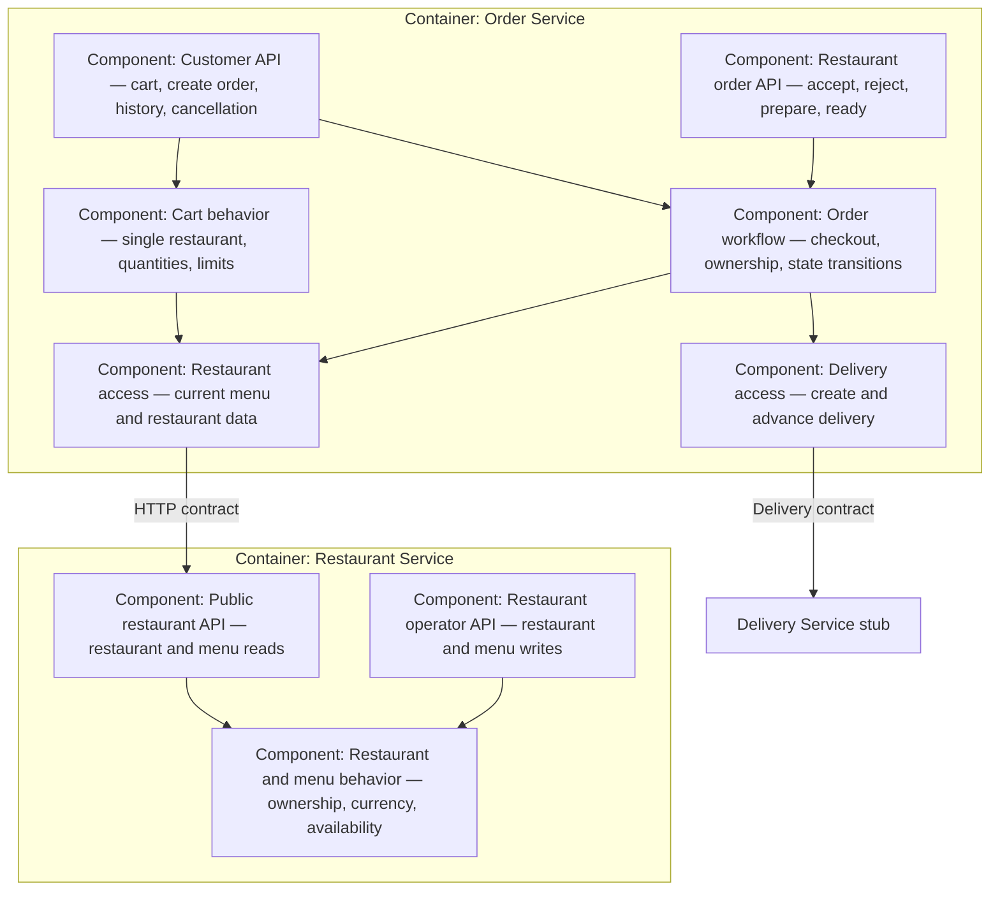
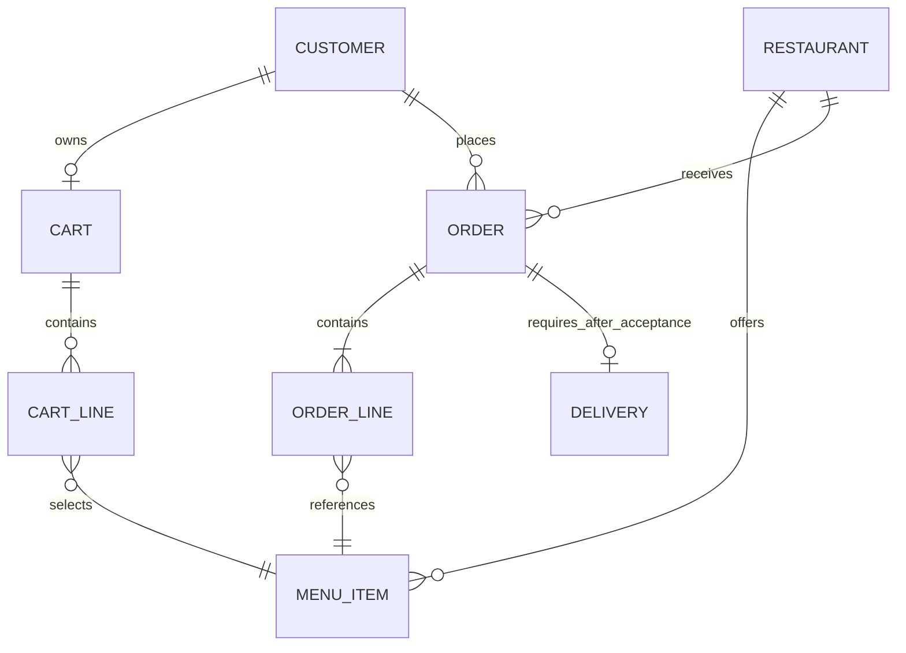
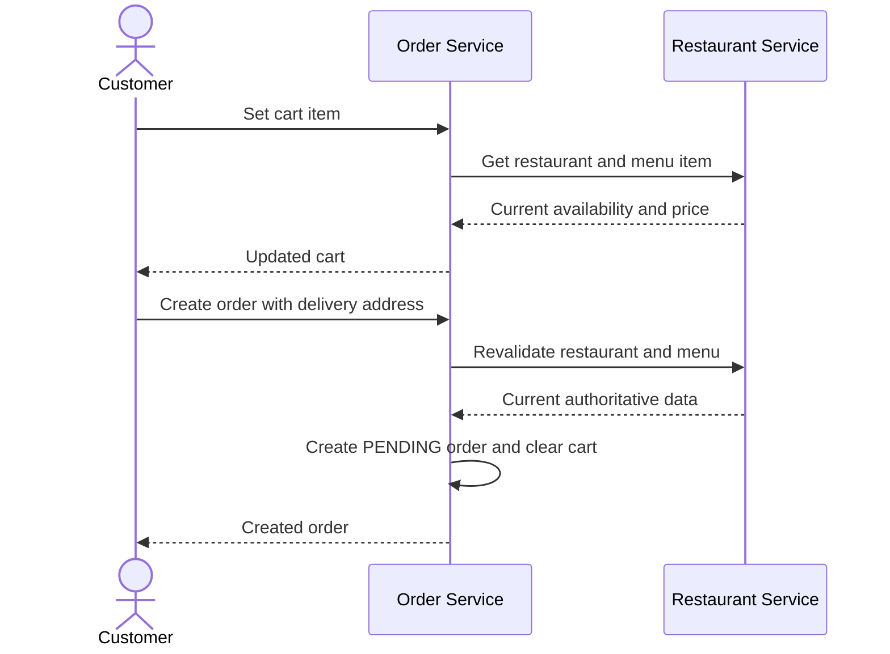
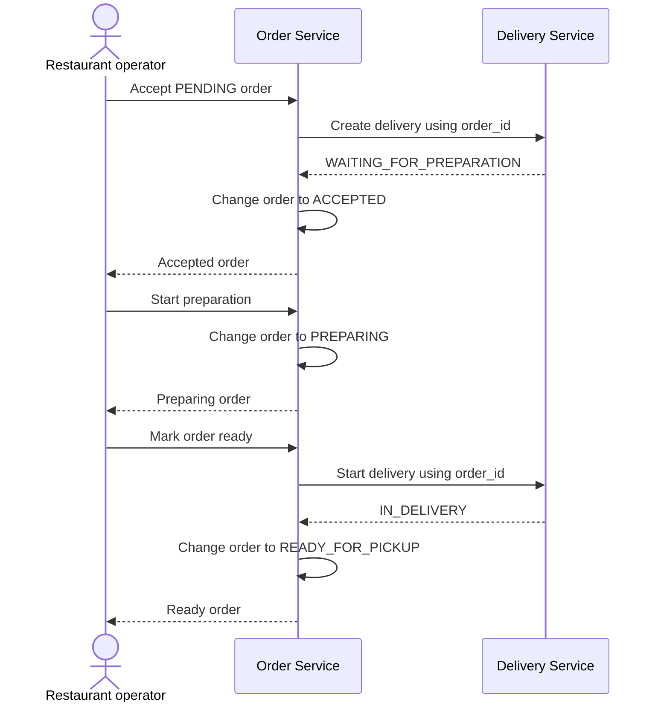

# Food Delivery architecture views

> Mentor working document. These diagrams explain service ownership and interactions; they do not prescribe Go packages, domain structs, or database tables.

C4 describes people, software systems, containers, and components. It does not describe domain-entity cardinality or behavior over time, so the C4 views below are followed by a domain relationship view and sequence diagrams.

## C4: system context

## C4: container view

## C4: logical component view

The components are responsibilities, not required packages or interfaces.

## Domain relationships

This view shows conceptual relationships only. Students choose their own domain and persistence models.

Important ownership rules:

- Restaurant Service owns Restaurant and Menu Item.
- Order Service owns Cart, Cart Line, Order, and Order Line.
- Delivery Service owns Delivery.
- Order Line preserves historical item data even though it references a Menu Item identifier.
- One accepted Order has exactly one Delivery, addressed by `order_id`.

## Sequence: add an item and create an order

If validation or creation fails, no Order is created and the Cart remains unchanged.

## Sequence: accept and prepare an order

If Delivery creation fails, the Order remains `PENDING`. If starting Delivery fails, the Order remains `PREPARING`.
